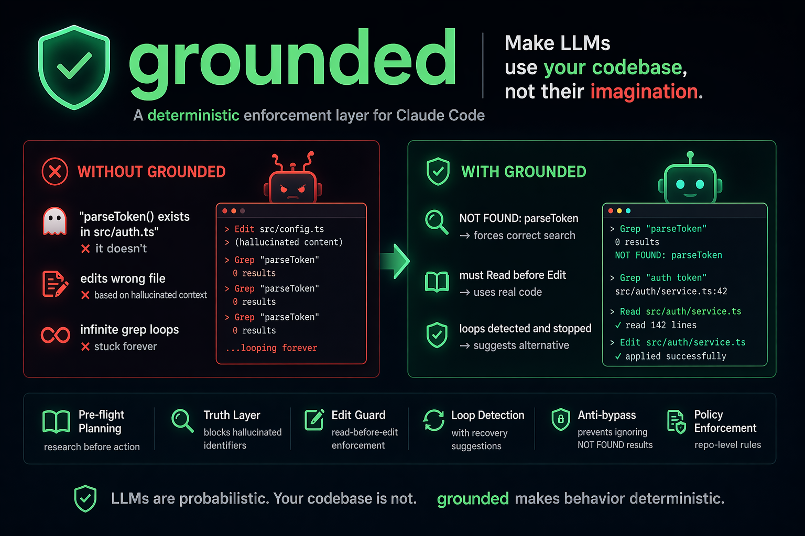

# grounded

**Make Claude use your codebase, not its imagination.**

Claude Code is getting worse.

Recent models:
- hallucinate functions that don't exist
- edit files they haven't read
- get stuck in loops
- ignore instructions after a few turns

Everyone using it has seen this.

`grounded` fixes it.

---

## TL;DR

Claude doesn't fail because it's dumb.

It fails because nothing enforces correct behavior.

`grounded` enforces:

- read before edit
- real file verification (no hallucinations)
- deterministic tool usage
- loop prevention

Result:

→ Claude becomes reliable  
→ even weaker models become usable

---

## Before vs After

**Without grounded**
> "parseToken() exists in src/auth.ts"  
❌ it doesn't

> edits wrong file  
❌ based on hallucinated context

> infinite grep loops  
❌ stuck forever

---

**With grounded**
> NOT FOUND: parseToken  
→ forces correct search

> must Read before Edit  
→ uses real code

> loops detected and stopped  
→ suggests alternative

---



---

## Why this works

The problem isn't the model.

It's that we trust it too much.

LLMs are probabilistic.  
Your codebase is not.

`grounded` assumes the model is wrong — and verifies everything.

---

## Works with weaker models

This doesn't make Claude smarter.

It makes it behave correctly.

When behavior is enforced:
- reasoning matters less
- correctness matters more

→ even smaller / local models become usable

---

## Install

```bash
npm install -g @pinperepette/grounded
grounded install
```

Restart Claude Code. You're done.

```bash
grounded status     # verify installation
grounded uninstall  # remove all hooks
```

---

## What it does

- Pre-flight planning (forces research before action)
- Truth layer (blocks hallucinated identifiers)
- Edit guard (read-before-edit enforcement)
- Loop detection with recovery suggestions
- Anti-bypass (prevents ignoring NOT FOUND results)
- Policy enforcement (repo-level rules)

---

## Modes

- `safe` → adaptive enforcement (default)
- `strict` → always cautious
- `autonomous` → fully locked down
- `silent` → minimal output, production-ready

---

## Example

User: "Fix parseToken bug"

Flow:

1. Grep("parseToken") → NOT FOUND
2. Model is blocked from using it
3. Forced to search correct identifier
4. Reads correct file
5. Applies valid edit

---

## Advanced

### Pre-flight planning

Before Claude even starts responding, `pre-flight` analyzes the prompt for intent (edit / create / debug / find) and any mentioned identifiers or file paths, then injects a concrete required tool sequence:

```
[GROUNDED — Pre-flight Plan]
Intent: EDIT  |  Identifiers: parseUserToken, AuthService  |  Files: src/auth.ts

Required sequence:
1. Grep("parseUserToken", ".") — verify existence and find location
2. Grep("AuthService", ".") — verify existence and find location
3. Read("src/auth.ts") — must read before any modification
4. Edit — only after all reads above are complete

Do NOT skip steps. Edits without prior Read will be blocked automatically.
```

The plan adapts to the model's current mental state: if it's already failing, the injected message is stronger.

### Truth layer

When a `Grep` call returns zero results, `truth-layer` injects a hard fact into the model's context immediately — before it can build further reasoning on top of a non-existent identifier:

```
[GROUNDED — Truth Layer] Grep("parseUserToken") returned NO results.
"parseUserToken" does NOT exist in this codebase.
You MUST NOT reference, call, import, or build on "parseUserToken" in your response.
If your plan depended on it, revise the plan now.
```

### Edit guard

The model edits a file it has never read, working from a stale mental snapshot. `edit-guard` blocks the edit and automatically injects the file's actual contents into the error message, so the model can formulate the correct edit immediately — no extra round trip required.

When the model generates an `Edit` call with an `old_string` that doesn't exist in the file, `edit-guard` verifies it against the real file content before the edit executes:

```
EDIT BLOCKED: The old_string you specified does not match the actual file content.
You are working from a stale or hallucinated snapshot.

CURRENT FILE CONTENTS:
```...```

Revise your old_string to match exactly.
```

### Loop detection

In autonomous or multi-step workflows, the model retries the same failing tool call indefinitely. `loop-detector` tracks a rolling window of tool call hashes and fires when it sees the same call repeated. It diagnoses the specific pattern and suggests the right alternative:

| Looping on | Suggested recovery |
|---|---|
| `Bash(grep ...)` | Use native `Grep` tool instead |
| `Bash(cat ...)` | Use native `Read` tool instead |
| `Bash(find ...)` | Use native `Glob` tool instead |
| `Edit` failing repeatedly | Re-read the file to get exact current content |
| `Grep` returning same result | Pattern not found — conclude NOT FOUND |

Loop patterns are persisted across sessions. If a pattern caused a loop before, the threshold drops by 1. In STRICT mode the threshold is forced to 1 regardless.

### Anti-bypass

The model Greps for `parseToken`, gets zero results, then uses `parseToken` in the very next Edit anyway. `anti-bypass` tracks every identifier that was confirmed NOT FOUND this session and checks all subsequent tool inputs against that list using word-boundary matching.

For Grep specifically: re-searching a confirmed-not-found pattern is blocked outright. For all other tools: if the input references a known-not-found identifier, a warning is injected before the tool executes:

```
[GROUNDED — Anti-bypass Warning]
This tool call references identifier(s) that were confirmed NOT FOUND in this codebase:
  - "parseToken"

You were already informed these do not exist. Using them anyway will produce broken output.
Revise your approach: either find the correct identifier via Grep, or acknowledge it doesn't exist.
```

### Confidence check

Before the response reaches you, `confidence-check` intercepts the `Stop` event and extracts every code identifier cited with explicit claim language. Each one is verified via `rg` against the actual codebase.

If any identifier is NOT FOUND, the Stop is blocked and the model is forced to revise:

```
[GROUNDED — Confidence Check Failed]
Your response cited the following identifiers that do NOT exist in the codebase:
  - `validateSession`
  - `src/middleware/tokens.ts`

You MUST revise your response:
1. For each identifier above, run Grep to confirm it does not exist.
2. Replace fabricated claims with "NOT FOUND: <identifier>"
3. Do not repeat these identifiers unless grep confirms they exist.
```

### Sensitive file protection

`scope-guard` hard blocks writes to:

- `.env`, `.env.local`, `.env.*`, `*.env`
- `*.pem`, `*.key`, `*.p12`, `*.pfx`, `*.crt`
- Any file matching `*secret*`, `*credential*`, `*password*`, `*api_key*`, `*auth_token*`
- `.npmrc`, `.netrc`

Reads are always allowed — the model can see these files, just not overwrite them.

### Project policies

Per-repository enforcement rules checked into source control and applied to every contributor. Configured in `.grounded.json`:

**`policies.noEdit`** — path substrings that are always blocked for editing:
```json
{ "policies": { "noEdit": ["migrations/", "generated/", "dist/"] } }
```

**`policies.requireTestRead`** — require reading a test file before any implementation file can be edited:
```json
{ "policies": { "requireTestRead": true } }
```

### Freshness check

`freshness-check` compares the file's `mtime` against the last read timestamp — if the file was actually modified after Claude read it, the hook warns (or blocks in CAUTIOUS/STRICT mode). Only real on-disk changes trigger it.

### Instruction drift

`CLAUDE.md` rules get silently ignored after ~5 turns as the context grows. `prompt-inject` re-injects the first 800 characters of your `CLAUDE.md` on every prompt, keeping the model anchored to project-specific rules throughout the session.

---

## Scoring engine

Every hook feeds a per-session score. The score drives dynamic enforcement — as the model misbehaves, thresholds tighten automatically without any user configuration.

### Events and weights

| Event | Base delta | Notes |
|---|---|---|
| `GREP_READ_EDIT_SEQUENCE` | +15 | Full correct workflow detected |
| `READ_BEFORE_EDIT` | +5 | File was read before editing |
| `CLAIMS_VERIFIED` | +4 | All cited identifiers found in codebase |
| `GREP_USED` | +3 | Grep tool used |
| `READ_USED` | +2 | Read tool used |
| `POLICY_VIOLATION` | −20 | Project policy rule triggered |
| `SENSITIVE_FILE` | −25 | Sensitive file write attempted |
| `LOOP_DETECTED` | −20 | Same call repeated past threshold |
| `HALLUCINATION_FOUND` | −15 | Identifier not found at Stop |
| `ANTI_BYPASS_TRIGGERED` | −12 | Tool input references confirmed-not-found identifier |
| `EDIT_WITHOUT_READ` | −10 | Edit without prior Read |
| `SCOPE_VIOLATION` | −10 | Write outside project root |
| `OLD_STRING_NOT_FOUND` | −8 | Edit with wrong/hallucinated old_string |
| `TOOL_MISUSE` | −5 | Generic Grep pattern or re-searching not-found identifier |
| `STALE_CONTENT_EDIT` | −5 | File changed since last read |

### Progressive penalties

Repeated bad behavior costs exponentially more:

| Occurrence | Multiplier |
|---|---|
| 1st | ×1.0 (base) |
| 2nd | ×2.5 |
| 3rd+ | ×5.0 |

A second `EDIT_WITHOUT_READ` costs −25 instead of −10. A third costs −50.

### Behavior levels

| Level | Score | Effect |
|---|---|---|
| `NORMAL` | ≥ 0 | Default thresholds from config |
| `CAUTIOUS` | < 0 | Loop threshold −1, freshness warnings become blocks |
| `STRICT` | < −30 | Loop threshold = 1, all scope warns become blocks, edit-guard stops injecting previews |

### Mental state

| State | Condition | Effect on pre-flight |
|---|---|---|
| `EXPLORATION` | Early session, no edits yet | Standard plan injected |
| `EXECUTION` | Has performed edits, score ok | Shorter reminder injected |
| `FAILING` | Score < −20 | Strong warning + mandatory plan |

```bash
grounded score    # show current session score, behavior level, and mental state
```

---

## How it works

Eleven hooks, each with a single responsibility:

| Hook | Event | Matcher | What it does |
|---|---|---|---|
| `prompt-inject` | `UserPromptSubmit` | — | Injects tool rules + CLAUDE.md + grep suggestions |
| `pre-flight` | `UserPromptSubmit` | — | Detects intent and injects required tool sequence |
| `read-tracker` | `PostToolUse` | `Read\|Grep\|Glob` | Records reads; tracks recent tool sequence |
| `truth-layer` | `PostToolUse` | `Grep` | Injects NOT FOUND fact when Grep returns nothing |
| `loop-detector` | `PostToolUse` | `.*` | Detects loops; suggests recovery; learns across sessions |
| `anti-bypass` | `PreToolUse` | `.*` | Blocks tool calls that reference confirmed-not-found identifiers |
| `edit-guard` | `PreToolUse` | `Edit\|Write\|MultiEdit` | Read-before-edit gate; old_string verification |
| `freshness-check` | `PreToolUse` | `Edit\|Write\|MultiEdit` | Warns/blocks if file changed since last read |
| `policy-guard` | `PreToolUse` | `Edit\|Write\|MultiEdit` | Enforces project-level noEdit and requireTestRead policies |
| `scope-guard` | `PreToolUse` | `Edit\|Write\|MultiEdit\|Bash` | Blocks sensitive files, system paths, out-of-scope writes |
| `confidence-check` | `Stop` | — | Verifies all cited identifiers exist before response delivered |

---

## Enforcement flow

```
User types a prompt
    ↓
[prompt-inject] ── injects enforcement rules + CLAUDE.md + grep suggestions
[pre-flight]    ── detects intent + mentioned identifiers/files
               ── injects required tool sequence (plan)
               ── mental state = FAILING → injects stronger warning
    ↓
Claude calls Grep("parseUserToken", ".")
    ↓
[read-tracker]  ── records search; updates recentSequence
                ── score += GREP_USED (+3)
[truth-layer]   ── Grep returned 0 results?
                   → inject: "parseUserToken does NOT exist"
                   → add to notFoundPatterns
    ↓
Claude calls Read("src/auth.ts")
    ↓
[read-tracker]  ── records file as read, with timestamp
                ── score += READ_USED (+2)
    ↓
Claude calls Edit("src/auth.ts", old_string="...", ...)
    ↓
[anti-bypass]       ── tool input references "parseUserToken"?
                       → confirmed NOT FOUND → score += ANTI_BYPASS_TRIGGERED (−12) → warn
[edit-guard]        ── file was read? ✓
                    ── old_string exists in file? ✓
                    ── Grep + Read in recent sequence? → score += GREP_READ_EDIT_SEQUENCE (+15)
                    ── score += READ_BEFORE_EDIT (+5) → approve

                    ── file NOT read? → score += EDIT_WITHOUT_READ (−10×progressive) → block + inject preview
                    ── old_string not found? → score += OLD_STRING_NOT_FOUND (−8) → block + inject actual content

[freshness-check]   ── file changed since read? → score += STALE_CONTENT_EDIT (−5) → warn or block
[policy-guard]      ── path matches noEdit rule? → score += POLICY_VIOLATION (−20) → hard block
[scope-guard]       ── sensitive file? → score += SENSITIVE_FILE (−25) → hard block
                       out of scope? → score += SCOPE_VIOLATION (−10) → warn or block
    ↓
[scoring engine]    ── recalculates BehaviorLevel + MentalState
                       NORMAL (≥0) / CAUTIOUS (<0) / STRICT (<−30)
                       progressive penalties active for repeated bad events
    ↓
Edit goes through
    ↓
[loop-detector] ── fires with tool-specific recovery if same call repeats
                ── score += LOOP_DETECTED (−20×progressive)
                ── writes pattern to persistent memory
    ↓
Claude produces final response
    ↓
[confidence-check] ── extracts claimed identifiers from response text
                   ── verifies each via rg in parallel
                   ── all found → score += CLAIMS_VERIFIED (+4) → approve
                   ── any NOT FOUND → score += HALLUCINATION_FOUND (−15) → block + force revision
                   ── stop_hook_active=true on second fire → approve (no infinite loop)
```

---

## CLI

```bash
grounded install      # add hooks to ~/.claude/settings.json
grounded uninstall    # remove all grounded hooks
grounded status       # list active hooks and their matchers
grounded score        # show session score, behavior level, mental state
grounded trace        # show decision log for the current/last session
grounded trace 100    # show last 100 decisions
grounded memory       # show learned loop patterns across sessions
grounded explain      # explain the last block with a specific fix suggestion
```

### Example: `grounded trace`

```
 GROUNDED TRACE — Session 84291  (2m ago)
 Started: 14:28:03

  14:28:05  INJECT      UserPromptSubmit  → injected rules + 2 grep suggestions
  14:28:05  INJECT      UserPromptSubmit  → pre-flight plan: EDIT, 2 identifiers
  14:28:07  TRACK       Read              src/auth/session.ts
  14:28:09  BLOCK       Edit              src/config.ts  → not read · preview injected
  14:28:11  TRACK       Read              src/config.ts
  14:28:12  APPROVE     Edit              src/config.ts
  14:28:13  WARN        Grep              parseToken  → pattern not found
  14:30:44  LOOP        Bash              Bash(grep -r parseToken)  → count=3
  14:31:00  SENSITIVE   Edit              /project/.env

 ────────────────────────────────────────────────────────────
  Files read: 2  │  Tracked: 2  │  Approved: 1  │  Blocked: 1  │  Loops: 1  │  Sensitive: 1
  Score: -45  │  Level: STRICT
```

### Example: `grounded score`

```
 GROUNDED SCORE

  Current score:  -45
  Behavior level: STRICT
  Mental state:   FAILING

  Recent events (last 7):

  14:28:07  +2   READ_USED                score → 2
  14:28:12  +5   READ_BEFORE_EDIT         score → 7
  14:28:12  +15  GREP_READ_EDIT_SEQUENCE  score → 22
  14:30:44  -20  LOOP_DETECTED            score → 2
  14:31:00  -25  SENSITIVE_FILE           score → -23
  14:31:05  -10  EDIT_WITHOUT_READ        score → -33
  14:31:10  -25  EDIT_WITHOUT_READ ×2     score → -58
```

---

## Configuration

Create `.grounded.json` in your project root or `~/.grounded.json` globally. Project-level takes precedence.

```json
{
  "mode": "safe",
  "hooks": {
    "promptInject":    true,
    "preFlight":       true,
    "editGuard":       true,
    "readTracker":     true,
    "loopDetector":    true,
    "scopeGuard":      true,
    "freshnessCheck":  true,
    "confidenceCheck": true,
    "truthLayer":      true,
    "antiBypass":      true,
    "policyGuard":     true
  },
  "loopDetector": {
    "threshold": 3,
    "windowSize": 10
  },
  "editGuard": {
    "requireReadBeforeEdit": false
  },
  "scopeGuard": {
    "mode": "warn",
    "extraAllowedRoots": ["/Users/you/shared-libs"],
    "blockedPaths": ["/etc", "/usr", "/bin", "/sbin", "/System", "/Windows"]
  },
  "policies": {
    "noEdit": [],
    "requireTestRead": false
  }
}
```

**`mode`**
- `"safe"` (default) — fully adaptive, thresholds tighten as score drops
- `"strict"` — minimum enforcement = CAUTIOUS level at all times
- `"autonomous"` — minimum enforcement = STRICT level, all warnings become hard blocks
- `"silent"` — minimal injection: only the 5 base enforcement rules per prompt. Truth-layer and loop-detector still send compact one-line hints. All hard blocks remain active.

**`scopeGuard.mode`**
- `"warn"` (default) — allows the edit but injects a warning
- `"block"` — hard blocks any edit outside the project root

**`editGuard.requireReadBeforeEdit`** — when `true`, any edit to an **existing** file requires a prior `Read` in the same session. Default `false`.

> ⚠️ This setting only applies to files that already exist on disk. Creating a brand-new file via `Write` (or `Edit`/`MultiEdit` on a path that does not yet exist) is always allowed — there is nothing to read. The `old_string` verification (gate 2) and `confidence-check` still cover the case where the model invents a path or claims a non-existent identifier.

**`scopeGuard.extraAllowedRoots`** — additional paths outside the project root where writes are allowed. Note: `~/.claude` and `~/Desktop` are always allowed unconditionally.

**`policies.noEdit`** — array of path substrings/prefixes that are always blocked for editing. Supports `*` glob.

**`policies.requireTestRead`** — when `true`, editing any implementation file requires reading a test file first.

---

## State and memory

**Session state** — `/tmp/grounded-{pid}.json`  
Fast, ephemeral. Tracks files read, tool call log, recent tool sequence, score, score event history, confirmed not-found patterns, and every hook decision. Cleaned up on reboot.

**Persistent memory** — `.claude/grounded-memory.json` (project) or `~/.claude/grounded-memory.json` (global)  
Survives reboots. Records loop patterns with occurrence counts so the system escalates faster on known-bad patterns in future sessions.

Memory is auto-pruned on every write to keep the file bounded:
- entries older than **30 days** are dropped (TTL)
- at most **500 entries** are kept per category (cap, most-recent first)

Override via env vars: `GROUNDED_MEMORY_TTL_DAYS`, `GROUNDED_MEMORY_MAX_ENTRIES`.  
Force a manual cleanup: `grounded memory --clean`.

**Hook crash log** — `~/.claude/grounded-errors.log` (override with `GROUNDED_ERROR_LOG`)  
Any uncaught error in a hook is logged here as JSONL and the hook fails open (Claude Code never sees a crashed hook). Rotates automatically when the file exceeds 256 KB.

---

## Philosophy

LLMs are not reliable by default.

Production systems need guarantees.

`grounded` enforces deterministic behavior  
at the only place it can be verified:

→ the tool boundary

---

## Requirements

- Node.js ≥ 18
- Claude Code (any version with hook support)
- `rg` (ripgrep) recommended but not required

---

## License

MIT
